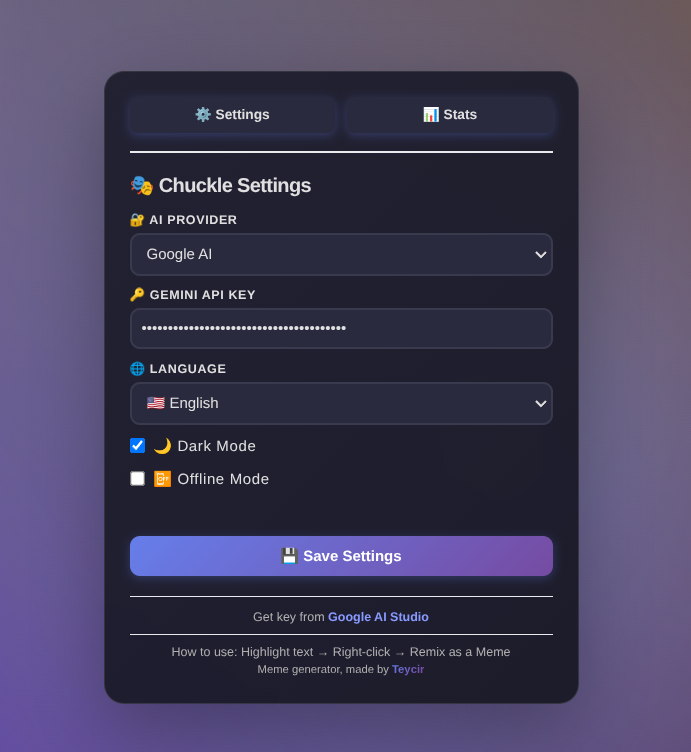

# Chuckle 🎭

## What is Chuckle?

**Chuckle** turns any text on the web into viral memes in seconds. Highlight text, right-click, and let AI create the perfect meme for you.

Think of it as your personal meme generator that lives in your browser. No design skills needed—just highlight, click, and share or save to disk. When API credits are exhausted you can continue manually offline.
Everything stays on your computer—no tracking, no data collection, no ads. Fully open-source.

<p align="center">
  
</p>


### ✨ What Can Chuckle Do?

- 🆓 **Free to Use** - Get 1,500 free memes every day using Google AI Studio's free tier, fallback use with OpenRouter
- 🔒 **Your Privacy is Safe** - Everything stays on your computer, no tracking
- ⚡ **Super Fast** - Get a meme in 2-3 seconds, try different templates instantly
- 🤖 **AI-Powered** - Gemini 2.5 Flash picks the perfect meme template for your text
- 🌍 **Speaks Your Language** - Available in English, Spanish, French, and German
- 🎨 **20 Meme Templates** - Drake, Distracted Boyfriend, Woman Yelling at Cat, and 17 more
- **Social Sharing** - Share instantly to Twitter, LinkedIn, or Email
- 📊 **Analytics Dashboard** - Track your meme stats, top templates, and share counts
- ✏️ **Edit Meme Text** - Click to edit text directly and manually then hit enter to regenerate
- ⌨️ **Keyboard Shortcuts** - Press `Alt+M` for instant meme generation from selected text

### Why Use Chuckle?

**🎨 No Design Skills Needed**
- Just highlight text and right-click
- AI picks the perfect meme template
- Professional-looking memes in seconds
- No uploading images or typing captions

**⚡ Super Fast**
- 1 click from text to meme (Alt+M shortcut)
- Try different templates instantly
- Download or share to Twitter, LinkedIn, or Email
- Edit text directly and regenerate

**🔒 Private & Secure**
- Your API key stays on your computer
- No tracking or data collection
- Open source code you can verify
- All meme data stored locally in your browser

### Who Should Use Chuckle?

**🔒 Privacy-Conscious People**
- All your memes stay on your computer
- No tracking or data collection
- Open source code you can verify yourself
- You control your own API key

**📱 Social Media Enthusiasts**
- Create viral content quickly
- Stand out with AI-generated memes
- Share funny reactions instantly

**💼 Content Creators**
- Add humor to your posts
- Engage your audience with memes
- Save time on content creation

**😄 Anyone Who Loves Memes**
- Turn any text into a meme
- Express yourself creatively
- Make the internet funnier

### How to Get Started (3 Easy Steps)

**Step 1: Install Chuckle (2 minutes)**
1. Open Chrome and go to `chrome://extensions/`
2. Turn on "Developer mode" (top right corner)
3. Click "Load unpacked" and select under the Chuckle folder the folder dist
4. You'll see the Chuckle icon appear in your browser

**Step 2: Get Your Free AI Key (1 minute)**

**Option A: Google AI (Recommended - Easiest)**
1. Visit [Google AI Studio](https://aistudio.google.com/app/apikey)
2. Sign in with your Google account
3. Click "Create API Key"
4. Copy the key (it looks like: AIza...)
5. Click the Chuckle icon in Chrome
6. Paste your key and click "Save Settings"

**Option B: OpenRouter (Alternative - More Models)**
1. Visit [OpenRouter](https://openrouter.ai/keys)
2. Sign up for a free account
3. Create an API key
4. Click the Chuckle icon in Chrome
5. Select "OpenRouter" from the dropdown
6. Paste your key and click "Save Settings"

**Which one should I choose?**
- Choose Google AI if you want the simplest setup
- Choose OpenRouter if you want access to different AI models
- Both give you 1,500 free memes per day

**Step 3: Start Making Memes**
1. Go to any website
2. Highlight 6-30 words of text (example: "When you finally understand recursion")
3. Right-click and select "Remix as a Meme"
4. Wait 2-3 seconds
5. Your meme is ready!

**Quick Tip**: Press `Alt+M` (or `Option+M` on Mac) to generate a meme instantly without right-clicking.

### How to Use Chuckle Features

**🎨 Try Different Templates**
- Click the template button to see all 20 available templates
- Click any template to regenerate your meme with that style
- Keep trying different templates until you find the perfect fit

**When to try different templates:**
- The first template doesn't quite fit the vibe
- You want to try different humor styles
- You're creating multiple versions for A/B testing
- You want to see all the creative possibilities

**⌨️ Keyboard Shortcuts**
- **Alt+M** (or **Option+M** on Mac): Generate meme from selected text (anywhere on any page)
- **Esc**: Close any open overlay

**🌍 Change Language**
1. Click the Chuckle icon
2. Select your language (English, Spanish, French, or German)
3. Click "Save Settings"
4. Now all memes will be in your language!

**🌙 Dark Mode**
1. Click the Chuckle icon
2. Check the "Dark Mode" box
3. Click "Save Settings"
4. All popups now use dark colors (easier on your eyes at night!)

**✏️ Edit Meme Text**
- Click on the meme text to edit it
- Make any changes you want
- Click outside to save automatically
- Regenerate uses your edited text

**⬇️ Download a Meme**
- Click the download button (↓) in the meme popup
- The meme saves to your Downloads folder
- Use it anywhere: social media, presentations, messages

**Share a Meme**
- Click the share button in the meme popup
- Choose: X (Twitter), LinkedIn, or Email
- The meme opens in a new tab or email client
- Add your caption and post!

**📊 View Your Stats**
- Click the Chuckle icon
- Click the "📊 Stats" tab
- See your meme creation statistics:
  - Total memes created
  - Top 5 most-used templates
  - Share counts (Twitter, LinkedIn, Email)
- Click "🎨 Browse Templates" to see all 20 available templates

**Why check your stats?**
- See which templates work best for you
- Track your most popular meme topics
- Discover templates you haven't tried yet

### Real-Life Examples

**Example 1: Funny Reaction**
- Highlight: "404 Error: Sleep Not Found"
- Press Alt+M
- Get: Perfect tired programmer meme
- Share on Twitter → Go viral!
- Time saved: 5 minutes of manual meme creation

**Example 2: Study Humor**
- Highlight: "Me pretending to understand the lecture"
- Right-click → "Remix as a Meme"
- Get: Relatable student meme
- Share in class group chat

**Example 3: Work Jokes**
- Highlight: "When the meeting could have been an email"
- Right-click → "Remix as a Meme"
- Get: Office humor meme
- Share with coworkers on Slack

**Example 4: News Commentary**
- Reading a funny news headline
- Highlight the headline
- Press Alt+M
- Get: Topical meme in 2 seconds
- Share your hot take on social media

**Example 5: Try Different Templates**
- Create meme: "When your code works on the first try"
- First result: Drake template (good, but not perfect)
- Click template button to see all options
- Select Success Kid template (perfect!)
- Download and share with your dev team

### Language Support

Chuckle works in 4 languages:
- 🇺🇸 **English**
- 🇪🇸 **Spanish** (Español)
- 🇫🇷 **French** (Français)
- 🇩🇪 **German** (Deutsch)

**Cool Feature**: All meme text is generated in your selected language!
- Select Spanish → Get memes in Spanish
- Select French → Get memes in French
- Perfect for international audiences and multilingual content


### Common Questions

**Q: Is Chuckle really free?**
A: Yes! Google gives you 1,500 free AI requests per day. That's enough for most people.

**Q: Is my data safe?**
A: Yes! Everything stays on your computer. Chuckle doesn't send your data to any servers.

**Q: Do I need to know anything technical?**
A: No! If you can right-click, you can use Chuckle. Just follow the 3 setup steps above.

**Q: What if I run out of free requests?**
A: You get 1,500 per day. That resets every 24 hours. Most people use 10-20 per day.

**Q: Can I use Chuckle on my phone?**
A: Not yet. Chuckle only works on Chrome browser on computers right now.

**Q: Does Chuckle work on all websites?**
A: Yes! Chuckle works on any website where you can highlight text. Just make sure to select between 6 and 30 words for best results.

**Q: Why do I need my own API key?**
A: This keeps Chuckle free and private. You connect directly to Google AI or OpenRouter, not through our servers.

**Q: What meme templates does Chuckle use?**
A: Chuckle has 20 popular templates including Drake, Distracted Boyfriend, Woman Yelling at Cat, Success Kid, and more. The AI picks the best one for your text.

**Q: What are the keyboard shortcuts?**
A: Alt+M (generate from selection), Esc (close).

**Q: Can I edit the meme text?**
A: Yes! Click on the meme text to edit it. Changes save automatically when you click outside.

**Q: How do I download or share memes?**
A: Click the ↓ button to download, or click the share button to share on Twitter, LinkedIn, or Email.

**Q: Where can I see my meme statistics?**
A: Click the Chuckle icon, then click the "📊 Stats" tab to see all your analytics.

**Q: What templates are available?**
A: Click the Chuckle icon, go to Stats tab, and click "🎨 Browse Templates" to see all 20 templates.

**Q: Can I create multiple meme variants?**
A: Yes! Click the template button to see all 20 templates and choose a different one.

### Tips for Best Memes

**✅ Do:**
- Highlight 6-30 words (required for best results)
- Use text with clear emotions or situations
- Try different phrases to see what works
- Try different templates to find the best fit
- Use Alt+M shortcut for instant generation
- Check your stats to see what works best

**❌ Don't:**
- Select less than 6 words (too little context)
- Select more than 30 words (too long for memes)
- Use text without context or humor
- Expect perfect results every time (AI is creative!)

### Your Privacy Matters

**What Chuckle Does NOT Do:**
- ❌ Collect your browsing history
- ❌ Track what memes you create
- ❌ Send your data to our servers (we don't have any!)
- ❌ Sell your information
- ❌ Show you ads

**What Chuckle DOES Do:**
- ✅ Stores your API key only in your browser
- ✅ Saves memes only on your computer
- ✅ Connects directly to Google AI for total privacy
- ✅ Works completely privately

**Open Source**: All our code is public on GitHub. Anyone can check what Chuckle does.

### Troubleshooting

**Problem: "No API key found"**
- Solution: Click the Chuckle icon and add your API key from Google AI Studio

**Problem: Meme takes too long**
- Solution: Check your internet connection. Memes usually take 2-3 seconds.

**Problem: "You must select between 6 and 30 words"**
- Solution: Make sure you highlight at least 6 words but no more than 30 words. This ensures the AI has enough context without being too long.

**Problem: "Could not generate meme"**
- Solution: Try highlighting different text. Some phrases work better than others.

**Problem: Right-click menu doesn't show "Remix as a Meme"**
- Solution: Make sure you've highlighted text first, then right-click.

**Problem: "API error"**
- Solution: Check your API key is correct. You might have hit the daily limit (1,500 requests).

**Problem: Keyboard shortcuts not working**
- Solution: Alt+M works anywhere on any webpage when you have text selected.

### Get Help

**Need Help?**
- Check the [Common Questions](#common-questions) section above
- Look at [Troubleshooting](#troubleshooting) for solutions
- Visit our [GitHub page](https://github.com/Teycir/Chuckle) for more info

**Want to Help Improve Chuckle?**
- Report bugs on GitHub
- Suggest new meme templates
- Share Chuckle with friends
- Leave a review

---

**Ready to make the internet funnier?** Install Chuckle today and turn any text into viral memes!

**Made with ❤️ for people who love memes**

---

## For Developers

### Technical Stack
- **TypeScript** - Type-safe code
- **Chrome Extension API** - Browser integration
- **Gemini 2.5 Flash** - AI-powered template selection
- **Jest** - 255 passing tests (100% coverage)
- **ESLint + Prettier** - Code quality

### Key Features
- **Social Sharing** - Twitter, Reddit, LinkedIn, Email integration
- **Analytics Dashboard** - Track stats
- **Editable Text** - Click to edit meme text inline
- **Template Browser** - Discover 20 meme templates
- **Keyboard Shortcuts** - Alt+M for instant generation
- **LRU Cache** - 1-hour TTL for API responses
- **Security** - XSS protection, input sanitization
- **Performance** - Debounced inputs, optimized rendering

### Documentation
- [ARCHITECTURE.md](docs/ARCHITECTURE.md) - System design and architecture
- [SECURITY_FIXES.md](docs/SECURITY_FIXES.md) - Security improvements
- [IMPROVEMENTS_APPLIED.md](docs/IMPROVEMENTS_APPLIED.md) - Recent enhancements
- [TESTING_GUIDE.md](docs/TESTING_GUIDE.md) - Testing checklist
- [FEATURES_IMPLEMENTED.md](FEATURES_IMPLEMENTED.md) - New features (v1.1.0)
- [WHY_EMAIL_NOT_FACEBOOK.md](WHY_EMAIL_NOT_FACEBOOK.md) - Platform decisions

### Build & Test
```bash
npm install          # Install dependencies
npm test            # Run all tests
npm run build       # Build extension
npm run lint        # Check code quality
npm run format      # Format code
```

### Contributing
Contributions welcome! Please:
1. Fork the repository
2. Create a feature branch
3. Add tests for new features
4. Ensure all tests pass
5. Submit a pull request

---

*Technical documentation: [ARCHITECTURE.md](docs/ARCHITECTURE.md) | Security: [SECURITY_FIXES.md](docs/SECURITY_FIXES.md)*
