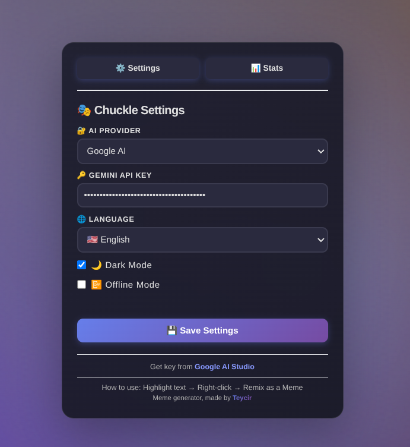

<!-- donation:eth:start -->
<div align="center">

## Support Development

If this project helps your work, support ongoing maintenance and new features.

**ETH Donation Wallet**  
`0x11282eE5726B3370c8B480e321b3B2aA13686582`

<a href="https://etherscan.io/address/0x11282eE5726B3370c8B480e321b3B2aA13686582">
  
</a>

_Scan the QR code or copy the wallet address above._

</div>
<!-- donation:eth:end -->


# Chuckle 🎭

## What is Chuckle?

**Chuckle** turns any text on the web into viral memes in seconds. Highlight text, right-click, and let Chuckle create the perfect meme for you.

Think of it as your personal meme generator that lives in your browser. No design skills needed—just highlight, click, and share or save to disk.
Everything stays on your computer—no tracking, no data collection, no ads. Fully open-source.

<p align="center">
  
</p>

### ✨ What Can Chuckle Do?

- 🆓 **Free to Use** - Generate memes instantly
- 🔒 **Your Privacy is Safe** - Everything stays on your computer, no tracking
- ⚡ **Super Fast** - Get a meme in 2-3 seconds, try different templates instantly
- 🌍 **Speaks Your Language** - Available in English, Spanish, French, and German
- 🎨 **20 Meme Templates** - Drake, Distracted Boyfriend, Woman Yelling at Cat, and 17 more
- **Social Sharing** - Share instantly to Twitter, LinkedIn, or Email
- 📊 **Analytics Dashboard** - Track your meme stats, top templates, and share counts
- ✏️ **Edit Meme Text** - Click to edit text directly and manually then hit enter to regenerate
- ⌨️ **Keyboard Shortcuts** - Press `Alt+M` for instant meme generation from selected text

### Why Use Chuckle?

**🎨 No Design Skills Needed**
- Just highlight text and right-click
- Professional-looking memes in seconds
- No uploading images or typing captions

**⚡ Super Fast**
- 1 click from text to meme (Alt+M shortcut)
- Try different templates instantly
- Download or share to Twitter, LinkedIn, or Email
- Edit text directly and regenerate

**🔒 Private & Secure**
- No tracking or data collection
- Open source code you can verify
- All meme data stored locally in your browser

### How to Get Started

**Step 1: Install Chuckle**
1. Open Chrome and go to `chrome://extensions/`
2. Turn on "Developer mode" (top right corner)
3. Click "Load unpacked" and select the `dist` folder inside the Chuckle project
4. You'll see the Chuckle icon appear in your browser

**Step 2: Start Making Memes**
1. Go to any website
2. Highlight 6-30 words of text (example: "When you finally understand recursion")
3. Right-click and select "Remix as a Meme"
4. Wait 2-3 seconds
5. Your meme is ready!

**Quick Tip**: Press `Alt+M` (or `Option+M` on Mac) to generate a meme instantly without right-clicking.

### How to Use Chuckle Features

**🎨 Try Different Templates**
- Click the template button to see all 20 available templates
- Click any template to regenerate your meme with that style
- Keep trying different templates until you find the perfect fit

**⌨️ Keyboard Shortcuts**
- **Alt+M** (or **Option+M** on Mac): Generate meme from selected text (anywhere on any page)
- **Esc**: Close any open overlay

**🌍 Change Language**
1. Click the Chuckle icon
2. Select your language (English, Spanish, French, or German)
3. Click "Save Settings"
4. Now all memes will be in your language!

**🌙 Dark Mode**
1. Click the Chuckle icon
2. Check the "Dark Mode" box
3. Click "Save Settings"
4. All popups now use dark colors

**✏️ Edit Meme Text**
- Click on the meme text to edit it
- Make any changes you want
- Click outside to save automatically
- Regenerate uses your edited text

**⬇️ Download a Meme**
- Click the download button (↓) in the meme popup
- The meme saves to your Downloads folder
- Use it anywhere: social media, presentations, messages

**Share a Meme**
- Click the share button in the meme popup
- Choose: X (Twitter), LinkedIn, or Email
- The meme opens in a new tab or email client
- Add your caption and post!

**📊 View Your Stats**
- Click the Chuckle icon
- Click the "📊 Stats" tab
- See your meme creation statistics:
  - Total memes created
  - Top 5 most-used templates
  - Share counts (Twitter, LinkedIn, Email)
- Click "🎨 Browse Templates" to see all 20 available templates

### Common Questions

**Q: Is Chuckle really free?**
A: Yes! It's completely free to use.

**Q: Is my data safe?**
A: Yes! Everything stays on your computer. Chuckle doesn't send your data to any servers.

**Q: Do I need to know anything technical?**
A: No! If you can right-click, you can use Chuckle.

**Q: Can I use Chuckle on my phone?**
A: Not yet. Chuckle only works on Chrome browser on computers right now.

**Q: Does Chuckle work on all websites?**
A: Yes! Chuckle works on any website where you can highlight text. Just make sure to select between 6 and 30 words for best results.

**Q: What meme templates does Chuckle use?**
A: Chuckle has 20 popular templates including Drake, Distracted Boyfriend, Woman Yelling at Cat, Success Kid, and more.

**Q: Can I edit the meme text?**
A: Yes! Click on the meme text to edit it. Changes save automatically when you click outside.

### Your Privacy Matters

**What Chuckle Does NOT Do:**
- ❌ Collect your browsing history
- ❌ Track what memes you create
- ❌ Send your data to our servers (we don't have any!)
- ❌ Sell your information
- ❌ Show you ads

**What Chuckle DOES Do:**
- ✅ Saves memes only on your computer
- ✅ Works completely privately

**Open Source**: All our code is public on GitHub. Anyone can check what Chuckle does.

### Troubleshooting

**Problem: "Meme takes too long"**
- Solution: Check your internet connection. Memes usually take 2-3 seconds.

**Problem: "You must select between 6 and 30 words"**
- Solution: Make sure you highlight at least 6 words but no more than 30 words.

**Problem: "Could not generate meme"**
- Solution: Try highlighting different text.

**Problem: Right-click menu doesn't show "Remix as a Meme"**
- Solution: Make sure you've highlighted text first, then right-click.

**Problem: Keyboard shortcuts not working**
- Solution: Alt+M works anywhere on any webpage when you have text selected.

### Get Help

**Need Help?**
- Check the [Common Questions](#common-questions) section above
- Look at [Troubleshooting](#troubleshooting) for solutions
- Visit our [GitHub page](https://github.com/Teycir/Chuckle) for more info

**Want to Help Improve Chuckle?**
- Report bugs on GitHub
- Suggest new meme templates
- Share Chuckle with friends
- Leave a review

---

**Ready to make the internet funnier?** Install Chuckle today and turn any text into viral memes!

**Made with ❤️ for people who love memes**

---

## For Developers

### Technical Stack
- **TypeScript** - Type-safe code
- **Chrome Extension API** - Browser integration
- **meme-gen** - Template formatting
- **Jest** - Testing framework
- **ESLint + Prettier** - Code quality

### Key Features
- **Social Sharing** - Twitter, Reddit, LinkedIn, Email integration
- **Analytics Dashboard** - Track stats
- **Editable Text** - Click to edit meme text inline
- **Template Browser** - Discover 20 meme templates
- **Keyboard Shortcuts** - Alt+M for instant generation
- **LRU Cache** - 1-hour TTL for API responses
- **Security** - XSS protection, input sanitization
- **Performance** - Debounced inputs, optimized rendering

### Documentation
- [ARCHITECTURE.md](docs/ARCHITECTURE.md) - System design and architecture
- [SECURITY_FIXES.md](docs/SECURITY_FIXES.md) - Security improvements
- [IMPROVEMENTS_APPLIED.md](docs/IMPROVEMENTS_APPLIED.md) - Recent enhancements
- [TESTING_GUIDE.md](docs/TESTING_GUIDE.md) - Testing checklist
- [FEATURES_IMPLEMENTED.md](FEATURES_IMPLEMENTED.md) - New features (v1.1.0)
- [WHY_EMAIL_NOT_FACEBOOK.md](WHY_EMAIL_NOT_FACEBOOK.md) - Platform decisions

### Build & Test
```bash
npm install          # Install dependencies
npm test            # Run all tests
npm run build       # Build extension
npm run build:browser # Build browser-runnable dist output
npm run lint        # Check code quality
npm run format      # Format code
```

### Contributing
Contributions welcome! Please:
1. Fork the repository
2. Create a feature branch
3. Add tests for new features
4. Ensure all tests pass
5. Submit a pull request

---

*Technical documentation: [ARCHITECTURE.md](docs/ARCHITECTURE.md) | Security: [SECURITY_FIXES.md](docs/SECURITY_FIXES.md)*
